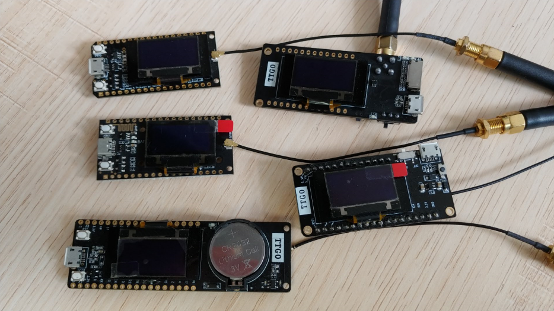
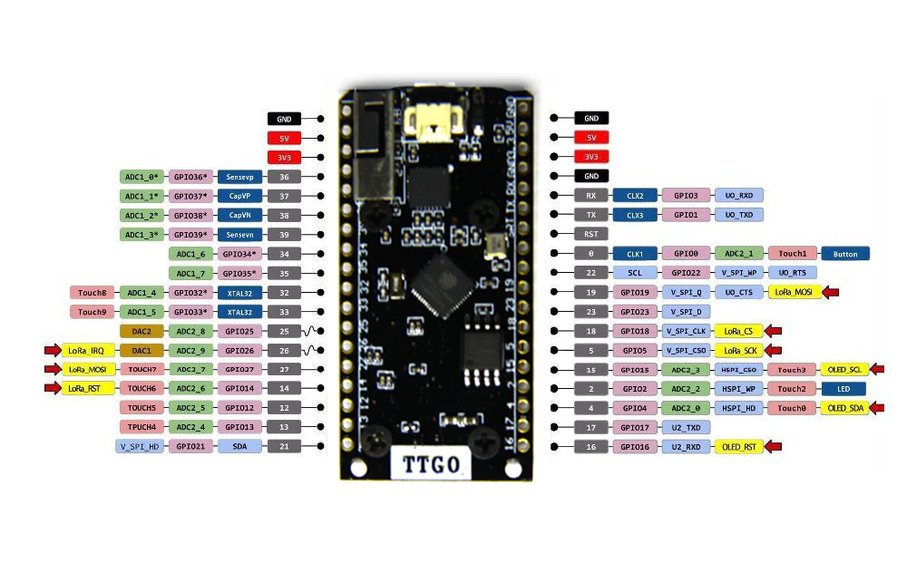

Testing Code for TTGO LoRa Series
=================================


I forked this repository as the tester for TTGO LoRa32 v1.0 board.
In case another version, please verify the setting inside board_def.h.

Just the LoRa transceiver and OLED that is tested,
    for other parts of the module, I discard the code.


## TTGO LoRa32 OLED V1.0





## Boards' pins

| Name        | V1.0 | V1.2(T-Fox) | V1.6 | V2.0 |
| ----------- | ---- | ----------- | ---- | ---- |
| OLED RST    | 16   | N/A         | N/A  | N/A  |
| OLED SDA    | 4    | 21          | 21   | 21   |
| OLED SCL    | 15   | 22          | 22   | 22   |
| SDCard CS   | N/A  | N/A         | 13   | 13   |
| SDCard MOSI | N/A  | N/A         | 15   | 15   |
| SDCard MISO | N/A  | N/A         | 2    | 2    |
| SDCard SCLK | N/A  | N/A         | 14   | 14   |
| DS3231 SDA  | N/A  | 21          | N/A  | N/A  |
| DS3231 SCL  | N/A  | 22          | N/A  | N/A  |
| LORA MOSI   | 27   | 27          | 27   | 27   |
| LORA MISO   | 19   | 19          | 19   | 19   |
| LORA SCLK   | 5    | 5           | 5    | 5    |
| LORA CS     | 18   | 18          | 18   | 18   |
| LORA RST    | 14   | 23          | 23   | 23   |
| LORA DIO0   | 26   | 26          | 26   | 26   |


## First

- For the first time, change the macro definition in `board_def.h` according to the corresponding layout and screen, and change the version to be used to 1.
    ```
    #define LORA_V1_0_OLED  0
    #define LORA_V1_2_OLED  0
    #define LORA_V1_6_OLED  0
    #define LORA_V2_0_OLED  1
    ```

- Set the corresponding macro definition according to the lora frequency of the actual module
    ```
    #define LORA_PERIOD 433
    // #define LORA_PERIOD 868
    // #define LORA_PERIOD 915
    ```

- Sender definition `LORA_SENDER` is 1, 0 is receiving


## Install the following dependency library files:

- [arduino-LoRa](https://github.com/sandeepmistry/arduino-LoRa)
- [oled-ssd1306](https://github.com/ThingPulse/esp8266-oled-ssd1306)


## Other references

- [TTGO LoRa32 SX1276 OLED Board: Getting Started with Arduino IDE](
    https://randomnerdtutorials.com/ttgo-lora32-sx1276-arduino-ide/)
- [Product Webpage](http://www.lilygo.cn/prod_view.aspx?TypeId=50003&Id=1134&FId=t3:50003:3)
